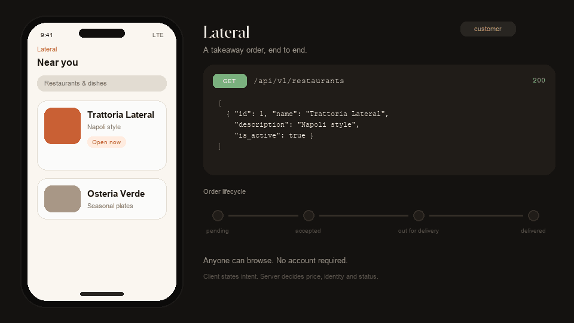

# Lateral

A small takeaway platform. Customers browse restaurants and menus, place orders,
and track them from `pending` to `delivered`; staff (admin) manage the catalogue
and advance orders. A FastAPI backend, plus a React web client served from the
same origin.

<p align="center">
  
</p>

Built with FastAPI, PostgreSQL, SQLAlchemy + Alembic, Pydantic, JWT, React +
TypeScript, Docker Compose and Nginx.

**Author:** Alghisi Alessandro Paolo — <alexalghisi@gmail.com>

---

## Quick start

Docker with the Compose plugin is the only requirement.

```bash
git clone https://github.com/alexalghisi/Lateral.git && cd Lateral
cp .env.example .env
# Generate a signing key and paste it over the SECRET_KEY line in .env:
python3 -c "import secrets; print('SECRET_KEY=' + secrets.token_urlsafe(64))"
docker compose up --build -d
curl http://localhost:8080/health/ready   # {"status":"ready"}
```

`docker compose up` builds both images, starts PostgreSQL, **applies migrations
automatically**, and serves the web app and the API behind one Nginx at
<http://localhost:8080> (Swagger at `/docs`, suppressed when
`APP_ENV=production`). Every setting is read from the environment — see
`.env.example`; `SECRET_KEY` has no default and the app refuses to start
without it.

```bash
docker compose exec -T api pytest   # 130 tests
docker compose down                 # stop (add -v to wipe the database)
```

---

## Architecture

Browser → Nginx → Uvicorn/FastAPI → PostgreSQL. Nginx serves the compiled SPA
and proxies `/api`, `/health` and the docs to the app server, so the whole
product answers on **one origin** — every request the browser makes is
same-origin and there is no CORS to configure anywhere. Each layer has one job:

- **Routers** (`app/api/routes/`) — HTTP in, call a service, return; auth is
  declared in the signature (`CurrentUser` / `CurrentAdmin`).
- **Schemas** (`app/schemas/`) — the request/response contracts; omitting price,
  total and identity makes abuse *unrepresentable*.
- **Services** (`app/services/`) — own the use case and the transaction, the
  only layer that commits.
- **Repositories** (`app/repositories/`) — own the SQL; no HTTP, no rules.
- **Domain** (`app/domain/`) — pure rules (state machine, roles, errors),
  imports nothing.
- **PostgreSQL** — `CHECK`, unique and `RESTRICT` constraints hold even if every
  layer above is bypassed.

Two things a reviewer will look for: **authorisation is a type** — an endpoint
without a `CurrentAdmin` argument simply cannot be admin-guarded, and OpenAPI
documents access for free; and services raise **domain errors** that one central
handler maps to HTTP (`NotFound`→404, `Conflict`→409, `PermissionDenied`→403,
`InvalidToken`→401), so no service imports `HTTPException`.

---

## API

All endpoints are under `/api/v1`; auth is `Authorization: Bearer <token>`. Login
is form-encoded (OAuth2 password flow). Registration always creates a customer;
the first admin is promoted out-of-band
(`UPDATE users SET role='admin' WHERE email=…`).

| Method | Path | Access | Description |
| --- | --- | --- | --- |
| `POST` | `/auth/register` | Public | Create a customer account (201). |
| `POST` | `/auth/login` | Public | Exchange credentials for a token. |
| `GET` | `/auth/me` | Authenticated | Current user. |
| `GET` | `/restaurants` · `/restaurants/{id}` · `/restaurants/{id}/menu` | Public | Browse the catalogue. |
| `POST`/`PATCH` | `/restaurants`, `/restaurants/{id}`, `/restaurants/{id}/menu` | **Admin** | Manage restaurants and menus. |
| `PATCH`/`DELETE` | `/menu-items/{id}` | **Admin** | Update or remove a menu item. |
| `POST` | `/orders` | Authenticated | Place an order (201) — no price in the body. |
| `GET` | `/orders` · `/orders/{id}` | Auth (own; **all** for admin) | Track orders. Supports `?status=`. |
| `PATCH` | `/orders/{id}/status` | **Admin** | Advance the lifecycle. |
| `GET` | `/health/live` · `/health/ready` | Public | Liveness / readiness (`SELECT 1`). |

Status codes: `401` bad/missing token · `403` wrong role · `404` absent *or* not
yours · `409` conflicts with current state · `422` malformed.

---

## Web client

A React + TypeScript SPA (Vite, React Router, TanStack Query) in `frontend/`:
browse restaurants, build a basket, place an order and watch it advance on a
live tracker; admins get catalogue management and the staff order queue.

It calls the API with **relative paths only** (`/api/v1/...`) — Nginx serves it
in production and Vite proxies the same paths in development, so there is no
base URL to configure and no CORS in either environment. `frontend/src/api/`
holds a typed `fetch` wrapper and hand-written mirrors of the response schemas,
so a contract change surfaces as a compile error rather than a runtime
`undefined`. The order state machine is mirrored from
`app/domain/order_state.py` to offer only legal next actions — the server
remains the authority and re-checks every transition.

```bash
cd frontend && npm ci
npm run dev        # http://localhost:5173, proxying to the stack on :8080
npm run typecheck  # tsc, strict
npm run build      # tsc -b && vite build
```

---

## Order lifecycle

```
pending ──▶ accepted ──▶ out_for_delivery ──▶ delivered
   │           │
   └───────────┴──▶ cancelled            (delivered / cancelled are terminal)
```

A declarative transition table in `app/domain/order_state.py` — adding a status
is adding a row. Enforced and tested: no skipping, no going backwards, terminal
states are final, and no self-transitions (a repeat is a `409`, surfacing lost
updates instead of hiding them). Transitions take a `SELECT … FOR UPDATE` lock;
`cancelled` is reachable only before dispatch.

---

## Data & money

Orders **snapshot** `item_name` and `unit_price_cents` onto `order_items` — a
receipt, not a live join — so later menu edits never rewrite history (a test
proves it). Money is integer **cents** end to end, since binary floats can't
represent `10.50`. Financial links (`orders → users/restaurants`, `order_items →
menu_items`) use `RESTRICT`; menus and order lines `CASCADE`. Retire a restaurant
with `is_active = false`, not a delete.

---

## Security

- Passwords hashed with **Argon2id** (`argon2-cffi`).
- **HS256 JWTs** with the algorithm pinned at verification; `exp`/`iat`/`sub`
  required.
- Auth failures are indistinguishable (constant-time dummy hash) — no account
  enumeration.
- Roles are never client-supplied; the user row is loaded per request, so
  deactivation is immediate.
- Secrets are `SecretStr`; Nginx hides its version, caps bodies at 1 MB and sets
  security headers; the container runs as a non-root user.

---

## Testing & migrations

**130 tests** run against **real PostgreSQL** — the test schema is built *by the
migrations* (a broken migration fails the suite before a deploy), and each test
runs in a transaction that is rolled back. Written test-first. The schema is only
ever changed by Alembic migrations, which run automatically on container start;
`alembic check` catches model/migration drift.

```bash
docker compose exec -T api ruff check . && \
docker compose exec -T api mypy app && \
docker compose exec -T api pytest && \
docker compose exec -T api alembic check
```

---

## Layout

```
app/  api · core · db · domain · models · repositories · schemas · services · main.py
frontend/  src/{api,auth,components,pages} · vite.config.ts · package.json
docker/  api/{Dockerfile,entrypoint.sh} · frontend/Dockerfile · nginx/default.conf
migrations/ · tests/ · docker-compose.yml · pyproject.toml · .env.example
```

---

**Alghisi Alessandro Paolo** — <alexalghisi@gmail.com> ·
<https://github.com/alexalghisi> · a technical-challenge submission built
test-first with FastAPI, PostgreSQL, SQLAlchemy, Alembic, React, Docker and
Nginx.
